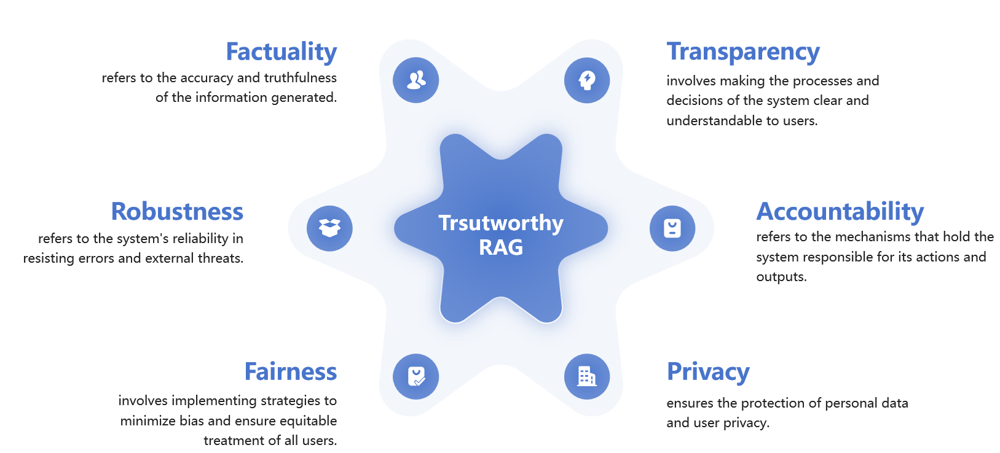

# Trustworthiness in Retrieval-Augmented Generation Systems: A Survey

This repository contains the code for the paper:
[Trustworthiness in Retrieval-Augmented Generation Systems: A Survey](url)


We identify six essential dimensions of trustworthiness in a RAG system: 

+ **Factuality** - refers to the accuracy and truthfulness of the information generated.

+ **Transparency** - involves making the processes and decisions of the system clear and understandable to users.

+ **Accountability** - refers to the mechanisms that hold the system responsible for its actions and outputs.

+ **Privacy** - ensures the protection of personal data and user privacy.

+ **Fairness** - involves implementing strategies to minimize bias and ensure equitable treatment of all users.

+ **Robustness** - refers to the system's reliability in resisting errors and external threats.

## Quick start

### Install environment

Install all required libraries by running
```bash
pip install -r requirements.txt
```

### Setup Model Path and Openai key (Optional)

You need to fill in the local path of the LLM you are using in `/config/model2path.json`, otherwise it will be downloaded from Huggingface by default. 

If you need to use Openai APIs such as GPT-4o, you need to configure the `api_key` and other settings in the `/config/openai_setting.json`.

### Run Evaluation

Just use following code to run evaluation on dimensions. You can modify the `model_list` inside to determine the model you want to evaluate.

```bash
bash run_eval.sh
```
