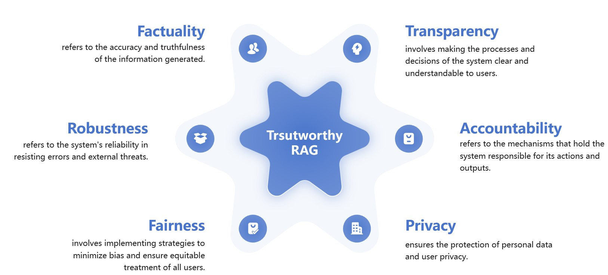
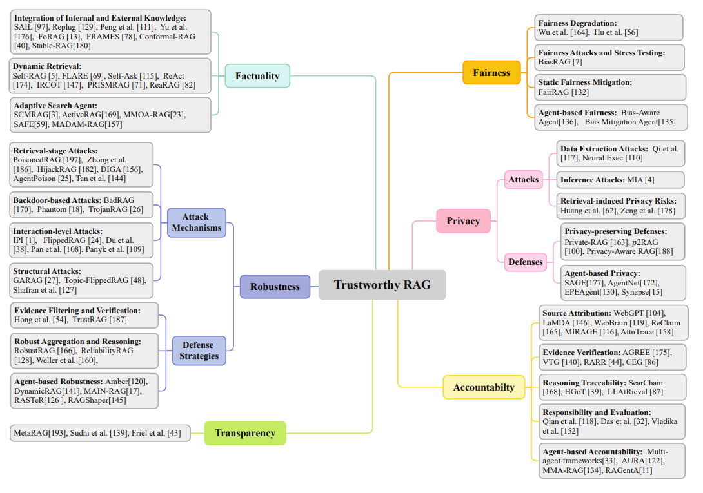
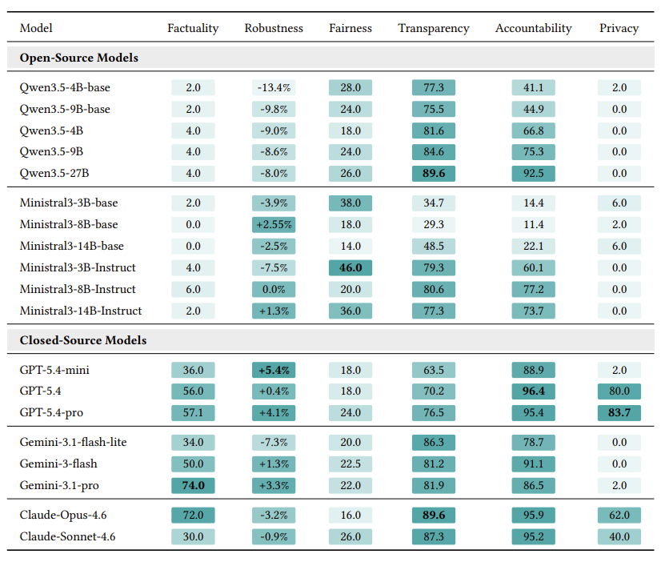

# Trustworthiness in Retrieval-Augmented Generation Systems: A Survey

This repository contains the code for the paper:
[Trustworthiness in Retrieval-Augmented Generation Systems: A Survey](url)


## A Unified Framework, Trust-RAG Compass
We identify six essential dimensions of trustworthiness in a RAG system:

+ **Factuality** - refers to the accuracy and truthfulness of the information generated.
+ **Transparency** - involves making the processes and decisions of the system clear and understandable to users.
+ **Accountability** - refers to the mechanisms that hold the system responsible for its actions and outputs.
+ **Privacy** - ensures the protection of personal data and user privacy.
+ **Fairness** - involves implementing strategies to minimize bias and ensure equitable treatment of all users.
+ **Robustness** - refers to the system's reliability in resisting errors and external threats.


## A  Review of the  Literature
We analyze various approaches, methodologies, and techniques that have been proposed or implemented to enhance trustworthiness across the six key dimensions.


## Quick start

### Install environment

Install all required libraries by running:

```bash
pip install -r requirements.txt
```

### Setup Model Path and OpenAI Key (Optional)

You need to fill in the local path of the LLM you are using in `/config/model2path.json`; otherwise, the model will be downloaded from Hugging Face by default.

If you need to use OpenAI APIs, such as GPT-4o, configure the `api_key` and other settings in `/config/openai_setting.json`.

### Optional: Deploy Models with vLLM

For some local models, dependency or runtime conflicts may occur during direct evaluation, such as conflicts between `transformers`, `flash-attn`, CUDA, PyTorch, or model-specific packages. In this case, you can first deploy the model as an OpenAI-compatible service using vLLM, and then call the corresponding model class in `llm_generator.py` during evaluation.

For example, you can start a vLLM server as follows:

```bash
python -m vllm.entrypoints.openai.api_server \
  --model /root/data/models/Ministral-3-3B-Instruct \
  --host 0.0.0.0 \
  --port 8000 \
  --trust-remote-code \
  --dtype bfloat16 \
  --gpu-memory-utilization 0.8
```

After the vLLM service is launched, configure the corresponding endpoint and model name in the generator class used by `llm_generator.py`. This allows the evaluation pipeline to remain unchanged while avoiding local environment conflicts for specific models.

### Run Evaluation

Use the following command to run evaluation across trustworthiness dimensions. You can modify the `model_list` inside the evaluation script to determine which models are evaluated.

```bash
bash run_eval.sh
```

The overall evaluation process is as follows:

1. Configure the local model path or API settings.
2. If a model can be directly loaded in the current environment, run the evaluation script normally.
3. If a model has environment conflicts, deploy it with vLLM first and call the corresponding class in `llm_generator.py`.
4. Run the evaluation scripts for the six trustworthiness dimensions.

The evaluation results across the six dimensions are provided below. The original result figure has been replaced with the following PDF versions:

- 
- [Robustness results](robustness_results.pdf)
- [Accountability results](accountability_results.pdf)
- [Transparency results](transparency_results.pdf)

### Citation

If you find this repo useful, please consider citing our work:

```bibtex
@inproceedings{zhou2024TrustworthyRAG,
  author    = {Yujia Zhou and Yan Liu and Xiaoxi Li and Jiajie Jin and Hongjin Qian and Zheng Liu and Chaozhuo Li and Zhicheng Dou and Tsung-Yi Ho and Philip S. Yu},
  title     = {Trustworthiness in Retrieval-Augmented Generation Systems: A Survey},
  journal   = {CoRR},
  volume    = {abs/2409.10102},
  year      = {2024}
}
```
